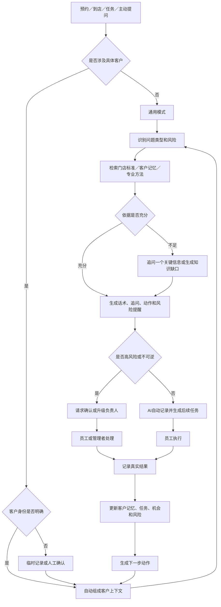

# AI 教练功能业务闭环（V1）

> 产品目标：让 AI 主动完成客户信息识别、服务辅助、结果整理和后续推进；员工只负责服务客户、处理异常和做关键决定。

## 1. 功能定位

AI 教练不是通用聊天机器人，而是门店员工的岗位工作助手。

它需要在正确的业务场景中，结合客户背景、门店标准和岗位权限，直接告诉员工：

- 现在应该说什么；
- 还需要问什么；
- 下一步应该做什么；
- 有什么风险需要注意。

每次服务或沟通结束后，AI 还要自动整理结果、更新客户记忆、生成后续任务，形成持续循环。

## 2. 核心原则

1. **默认自动完成**：高可信、低风险的识别、总结、记录和任务生成由 AI 在后台完成。
2. **员工只处理例外**：仅在身份不确定、高风险、低可信重大变化或不可逆操作时请求确认。
3. **按需关联客户**：具体客户问题进入客户模式；通用业务问题不强制选择客户。
4. **不以姓名识别客户**：姓名只用于显示，所有数据必须关联系统唯一客户 ID。
5. **事实与推测分离**：系统记录、员工确认、客户原话和 AI 推测必须标明来源及可信度。
6. **回答必须推动行动**：AI 不只提供分析，还要形成负责人、时间、动作和完成标准。
7. **所有自动操作可追溯、可修改、可撤回**。

## 3. 两种使用模式

### 3.1 客户模式

适用于具体客户的服务、沟通、异议和跟进。

进入来源：

- 今日预约或到店客户；
- 客户详情；
- 客户任务；
- 会谈或服务记录；
- AI 教练首页主动关联客户。

从业务页面进入时自动绑定客户，不要求员工重复搜索或介绍客户背景。

### 3.2 通用模式

适用于不针对具体客户的问题，例如服务 SOP、投诉流程、项目知识、沟通方法和门店制度。

AI 根据门店知识、系统专业方法和员工岗位权限回答，不要求关联客户。

## 4. 客户身份与数据基础

### 4.1 客户身份

系统内部为每位客户生成唯一客户 ID，员工无需记忆。客户到店时按照以下顺序关联：

1. 预约或签到记录；
2. 手机号、微信标识或会员号；
3. 前台确认的今日到店记录；
4. 员工根据客户识别卡人工选择。

客户识别卡展示预约时间、微信昵称、最近到店、负责人和最近事项等辅助信息。

同名客户不得自动合并。身份无法确认时，先创建临时服务记录，确认后再关联正式客户。

### 4.2 数据可信层级

从高到低依次为：

1. 系统真实记录：预约、到店、订单、项目、任务结果；
2. 员工确认信息；
3. 从客户原话中提取的信息；
4. AI 综合推测。

AI 自动产生的客户观察必须保存来源、时间、可信度和状态，不得直接覆盖已确认事实。新旧信息冲突时保留历史，并以最新证据决定当前状态。

## 5. 端到端业务闭环



## 6. 员工实际使用流程

### 6.1 服务前

AI 自动生成一张 30 秒服务简报：

- 客户最近一次服务和结果；
- 本次可能的核心需求；
- 未完成事项或历史承诺；
- 建议重点追问的问题；
- 风险、禁忌和注意事项；
- 一句可以直接使用的开场话术。

员工无需确认，发现错误时再修改。

### 6.2 服务中

员工可自由提问，也可通过场景入口快速求助：

- 客户提出异议；
- 需要继续追问；
- 询问价格或活动；
- 反馈效果或不满；
- 需要店长协助。

AI 首屏只展示四项：

1. 可以直接说的话；
2. 接下来要问的问题；
3. 下一步动作；
4. 风险提醒。

分析依据和详细策略默认折叠。

### 6.3 服务后

AI 根据会谈、快捷记录和业务数据自动完成：

- 本次需求和客户反应总结；
- 新顾虑、新偏好和风险提取；
- 员工承诺和未完成事项识别；
- 客户记忆更新；
- 跟进任务、负责人和建议时间生成；
- 下一次沟通话术准备。

页面只显示“AI 已自动完成的事项”。员工发现错误时再查看、修改或撤回，不逐项强制确认。

## 7. 问题处理规则

| 问题类型 | 处理方式 |
| --- | --- |
| 门店事实：价格、活动、退款、赠送、制度 | 只使用门店有效标准；没有依据时禁止猜测，转为待确认知识缺口 |
| 客户沟通：需求、顾虑、异议、跟进 | 使用客户背景、近期互动、门店经验和专业方法 |
| 通用方法：服务、沟通、销售技巧 | 可使用系统专业知识，但明确标注为通用建议 |
| 信息不足 | 只追问一个最影响判断的问题 |
| 高风险：异常反应、严重投诉、退款纠纷、违规承诺 | 停止自由发挥，执行风险流程并升级负责人 |

## 8. AI 自动化与人工确认边界

### 8.1 默认自动执行

- 客户上下文整理；
- 服务前简报；
- 会谈转写和总结；
- 需求、顾虑、偏好和客户反应提取；
- AI 观察和识别摘要更新；
- 低风险跟进任务生成；
- 交接卡和后续话术准备；
- 风险提示和知识缺口发现。

### 8.2 必须确认或升级

- 客户身份存在歧义；
- 合并或删除客户档案；
- 修改已确认的重要事实；
- 价格、折扣、赠送、退款等对外承诺；
- 严重投诉、身体异常及其他高风险事件；
- 低可信但会影响客户阶段、权益或重要决策的判断；
- 自动向客户发送个性化消息等外部动作。经门店预先审核并启用的标准通知可按规则自动发送。

## 9. 行动与结果闭环

每条 AI 建议必须尽量落为结构化动作：

- 关联对象；
- 负责人；
- 建议执行时间或截止时间；
- 具体动作；
- 推荐话术；
- 完成标准；
- 风险和升级条件。

员工执行后只需记录最小结果：已接受、仍有顾虑、已预约、暂不考虑、未回复、需要升级或信息有误。

AI 根据结果自动决定：

- 结束任务；
- 生成下一次跟进；
- 更新客户当前状态；
- 标记风险；
- 调整后续话术；
- 形成待审核的门店经验。

## 10. 风险与异常闭环

风险处理不能停留在“通知店长”，必须形成：

```text
发现风险 → 自动保留依据 → 通知负责人 → 确认接收
→ 给出处理方案 → 员工执行 → 记录客户结果 → 关闭或继续升级
```

当网络、模型或语音服务不可用时，系统仍应提供客户最近记录、门店标准 SOP、手动记录和负责人升级入口。

## 11. 知识与经验回流

- 门店没有明确答案的问题自动进入知识缺口；
- 店长补充并审核后成为门店标准；
- 客户个体信息只进入客户记忆，不进入公共知识库；
- 优秀案例必须脱敏、验证结果并经审核后，才能沉淀为门店经验；
- 被员工纠正或实际结果不佳的 AI 建议，应降低可信度并用于后续优化。

## 12. 闭环完成标准

AI 教练达到以下条件，才算形成有效闭环：

1. 具体客户场景能自动关联客户，且不会仅凭姓名串档；
2. 员工不需要重复输入系统已有信息；
3. AI 回答有依据，不编造门店事实；
4. 高可信、低风险事项自动完成，员工主要处理例外；
5. 每个建议都有明确动作、负责人、时间和结果；
6. 客户结果能自动更新记忆并驱动下一步；
7. 高风险事件有人接收、处理并关闭；
8. 所有 AI 自动记录均有来源、可信度、历史版本和撤回能力。

