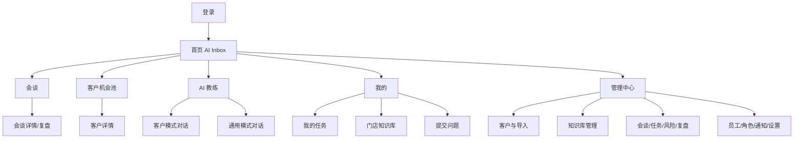

# 门店 AI 助手前端产品需求文档（V1.0）

> 文档定位：用于产品、UI/UX、前端和后端共同评审门店 AI 助手的前端范围、页面结构和交互标准。  
> 当前产品形态：前后端分离，前端、后端和数据库分别部署在阿里云；本文只定义前端产品体验，不改变部署架构。  
> 产品基线：保留当前首页内容顺序和五栏导航，延续已经确认的“纯白高质感 AI Inbox”方向。

---

## 1. 产品概述

### 1.1 产品定位

门店 AI 助手不是传统 CRM、通讯录或后台报表系统，而是门店员工每天使用的 **AI 经营 Inbox 与岗位工作助手**。

系统需要主动告诉员工：

- 今天应该优先处理谁；
- 为什么现在需要处理；
- 面对客户应该说什么、问什么；
- 下一步应该做什么；
- 有什么风险需要注意；
- 服务或沟通结束后，系统自动整理了什么。

核心业务闭环：

```text
客户/门店事件 → AI 识别机会或风险 → 生成行动卡
→ 员工执行 → 记录最小结果 → AI 更新客户记忆、任务、机会和风险
→ 生成下一步行动
```

### 1.2 前端产品目标

1. 员工进入首页后，30 秒内知道今天最重要的工作。
2. 美容师服务客户时，尽量不搜索、不重复输入、不填写复杂表单。
3. AI 建议必须能直接执行，而不是只输出长篇分析。
4. 客户、会谈、任务、AI 教练和知识库之间能够相互关联。
5. 高可信、低风险操作默认自动完成；人工只处理关键例外。
6. 所有 AI 自动生成的内容可查看来源、可修改、可撤回。
7. 在网络、模型或语音服务失败时，前端仍提供可继续工作的降级路径。

### 1.3 产品原则

- **行动优先**：先显示“说什么、问什么、做什么、注意什么”。
- **少打扰员工**：不逐项要求确认，发现错误时再修改或撤回。
- **按场景组织**：围绕到店、咨询、护理、成交、回访和风险处理组织页面。
- **客户不串档**：姓名只用于显示，客户关联以系统唯一 ID 为准。
- **事实不混淆**：系统事实、员工确认、客户原话、AI 推测分层展示。
- **结果驱动下一步**：每次执行后都进入结果回流，而不是停留在“已完成”。
- **渐进式展示**：首屏只展示当前最需要的信息，详细依据默认折叠。

---

## 2. 目标用户

| 用户角色 | 主要目标 | 高频任务 | 前端侧重点 |
| --- | --- | --- | --- |
| 美容师/护理师 | 快速了解客户、完成服务、减少记录负担 | 服务前准备、服务中求助、服务后记录、回访 | 极低输入、语音优先、客户自动关联、直接话术 |
| 咨询师/销售顾问 | 提高咨询成交和跟进质量 | 异议处理、项目推荐、成交推进、客户跟进 | 客户画像、成交阻碍、推荐话术、行动卡 |
| 前台 | 准确识别到店客户并完成交接 | 预约确认、到店签到、同名客户识别、人员交接 | 身份识别卡、少步骤选择、异常提示 |
| 店长 | 管理任务、风险和知识缺口 | 查看执行情况、分配任务、处理投诉、审核标准答案 | 例外队列、可追溯记录、批量处理、闭环状态 |
| 老板/经营者 | 了解经营卡点并推动增长 | 查看高价值客户、风险、员工执行和经营复盘 | 经营摘要、趋势、关键问题、下一步动作 |
| 运营人员 | 维护活动、知识、客户导入和通知 | 知识资料维护、批量导入、活动配置、通知发布 | 批量操作、进度反馈、错误定位、审核状态 |
| 系统管理员 | 管理角色、权限和 AI 配置 | 员工账号、角色权限、模型配置、隐私策略 | 权限边界、安全提示、配置验证、审计记录 |

### 2.1 权限基本规则

- 普通员工默认只查看自己负责或当前业务明确授权的客户。
- 店长和老板可进入管理端，查看全店客户、会谈、任务、风险和经营复盘。
- 客户隐私字段、录音、删除、合并、价格承诺等操作必须按权限控制。
- 无权限页面不应先展示内容再跳走，应在进入前完成权限判断。

---

## 3. 核心使用场景

### 3.1 员工开始一天工作

员工打开首页，查看今日重点客户、待跟进、今日到店和待复盘会谈；按经营价值处理 AI 工作卡。

### 3.2 客户到店与服务准备

员工从预约、到店记录或任务进入客户，系统自动绑定唯一客户 ID，生成 30 秒服务简报、开场话术、重点追问和风险提醒。

### 3.3 服务中即时求助

客户提出异议、反馈效果、询问价格或出现异常时，员工从客户页或会谈页进入 AI 教练。AI 自动携带客户背景，首屏给出直接话术、追问、动作和风险。

### 3.4 服务后自动收尾

录音结束后，系统在后台完成上传、转写、分析、客户记忆提取和跟进任务生成。员工只处理识别错误、客户身份歧义或高风险事项。

### 3.5 离店后跟进与结果回流

到期任务出现在首页和“我的任务”。员工使用推荐话术执行，只选择最小结果；AI 据此关闭任务、更新客户状态或生成下一步。

### 3.6 通用业务提问

员工询问项目知识、服务 SOP、投诉流程或沟通方法时，进入 AI 教练通用模式，不强制选择客户。

### 3.7 门店知识补全

AI 无法回答价格、活动、退款、赠送等门店事实时，前端提示“待店长确认”，并自动进入知识缺口队列。审核后成为门店标准答案。

### 3.8 店长处理关键例外

店长集中处理身份歧义、高风险事件、低可信重大变化、知识缺口、档案合并和不可逆操作，不被普通低风险事项打扰。

---

## 4. 信息架构与页面列表

### 4.1 一级导航

员工端固定五栏导航：

1. 首页
2. 会谈
3. 客户
4. AI 教练
5. 我的

知识库不增加为底部导航，放在“我的”中的一级入口。老板和店长通过首页“管理”或“我的”进入管理端。



### 4.2 页面清单

| 页面组 | 页面 | 路由基线 | 主要用户 | 优先级 |
| --- | --- | --- | --- | --- |
| 账号 | 登录、注册/建店、启动入口 | `/login`、`/register`、`/start` | 全部用户 | P0 |
| 核心工作台 | 首页 AI Inbox | `/home` | 全部员工 | P0 |
| 会谈 | 会谈列表与录音、会谈详情/复盘 | `/meeting`、`/meeting/[id]` | 员工、店长 | P0 |
| 客户 | 客户机会池、客户详情 | `/customers`、`/customers/[id]` | 员工、店长 | P0 |
| AI 教练 | AI 教练首页、对话页 | `/chat` | 全部员工 | P0 |
| 个人工作 | 我的、我的任务、提交问题 | `/me`、`/tasks`、`/submit` | 全部员工 | P0 |
| 知识阅读 | 门店知识库 | `/knowledge` | 有权限员工 | P1 |
| 管理入口 | 管理中心 | `/admin` | 老板、店长 | P0 |
| 客户管理 | 全部客户、待分配、客户详情、批量导入 | `/admin/customers`、`/customers/import` | 管理者、运营 | P1 |
| 知识管理 | 资料、上传、缺口、标准答案、禁用词、详情 | `/admin/knowledge/*` | 管理者、运营 | P1 |
| 经营管理 | 会谈复盘、增长动作、风险、经营日报 | `/admin/meetings`、`/admin/tasks`、`/admin/risks`、`/admin/reports` | 老板、店长 | P1 |
| 组织管理 | 员工、角色权限、通知 | `/admin/employees`、`/admin/roles`、`/admin/announcements` | 老板、店长 | P1 |
| AI 监督 | 员工提问、待确认问题 | `/admin/chats`、`/admin/pending` | 老板、店长 | P1 |
| 系统设置 | 自定义配置、AI 模型、录音隐私 | `/settings/config`、`/settings/ai`、`/settings/privacy` | 管理员 | P1 |

---

## 5. 员工端页面需求

### 5.1 登录页

**页面目标**：让员工快速、安全进入所属门店和角色工作台。

**模块结构**：

1. 品牌区：门店 AI 助手名称、简短价值说明。
2. 登录表单：账号、密码、显示/隐藏密码。
3. 主操作：登录。
4. 辅助入口：创建门店账号、忘记密码或联系管理员。
5. 环境提示：正式线上入口与本地测试入口明确区分。
6. 错误区域：显示真实可理解错误，不统一伪装为网络错误。

**关键交互**：登录中禁用重复提交；登录成功后按角色进入首页；登录失效时保留原目标页面，重新登录后返回。

### 5.2 首页 AI Inbox

**页面目标**：成为员工每天的第一工作入口，回答“今天先处理什么”。

**现有顺序必须保留**：页头 → 搜索 → 四张概览卡 → 分段标签 → 今日 AI 工作台 → 底部导航。

**模块结构**：

1. 品牌与身份页头
   - 门店 AI Inbox 标识；
   - 当前门店、岗位或工作场景；
   - 老板/店长显示“管理”入口。
2. 全局搜索
   - 搜索客户、会谈、知识、话术和任务；
   - 支持最近搜索与分类结果。
3. 四张概览卡
   - 今日重点客户；
   - 今日待跟进；
   - 今日到店客户；
   - 待复盘会谈。
4. 工作筛选
   - 今日重点；
   - 高价值；
   - 风险。
5. 今日 AI 工作台
   - 按经营价值和紧急程度排序；
   - 每张卡展示对象、原因、AI 判断、建议动作、推荐话术、时间和风险标签；
   - 支持进入客户、进入 AI 教练和直接处理任务结果。
6. 底部五栏导航。

**关键交互**：

- 搜索框必须产生真实搜索结果，不作为装饰。
- 四张概览卡均可点击，并打开对应的已筛选列表。
- 工作卡整卡进入业务对象；“问 AI”和“处理结果”是独立操作。
- 筛选切换保留当前位置；返回首页时保留上次标签。
- 数据刷新不应打乱用户正在处理的卡片位置。

### 5.3 会谈页

**页面目标**：用最少步骤开始一次已关联客户和场景的会谈记录。

**模块结构**：

1. 顶部标题与返回入口。
2. 快速录音设置
   - 新客户/已有客户；
   - 客户搜索与识别卡；
   - 我负责的客户/其他授权客户分组；
   - 会谈场景；
   - 录音与隐私提示；
   - 开始录音。
3. 录音状态条
   - 录音时长；
   - 录音中/暂停/上传中；
   - 暂停、继续、结束。
4. 我的会谈记录
   - 客户、场景、时间、负责人；
   - 录音中、转写中、分析中、已完成、失败；
   - 质量得分或风险提示；
   - 进入会谈详情。
5. 底部导航。

**客户身份规则**：

- 已有客户必须以唯一客户 ID 关联，姓名不可作为唯一依据。
- 同名客户显示预约时间、手机号脱敏、微信昵称、最近到店、负责人等识别信息。
- 无法确认时创建临时服务记录，之后再关联正式客户。
- 新客户姓名可暂缺，但前端要明确显示“临时客户”，不能伪装成已确认档案。

### 5.4 会谈详情/AI 复盘页

**页面目标**：把录音变成可执行的客户服务和经营信息。

**模块结构**：

1. 会谈概览：客户、场景、时间、员工、处理状态。
2. 处理中状态：上传、转写、分析的当前阶段和预计说明。
3. AI 复盘摘要：真实需求、主要顾虑、员工亮点、错失机会、风险。
4. 下一步行动：负责人、执行时间、动作、推荐话术、完成标准。
5. 客户记忆变化：本次新增/更新内容、来源和可信度。
6. 经验沉淀：候选经验、审核状态、是否进入门店经验。
7. 完整转写：按说话角色展示，可折叠、搜索和定位。
8. 异常处理：重试转写、手动记录、重新关联客户、升级负责人。

**关键交互**：

- 页面可在处理中安全退出，后台继续执行。
- 处理完成后通过站内状态或首页卡片提醒，不要求用户停留等待。
- 转写失败不能丢失录音状态；支持重试或手动补充。
- AI 结果允许修改或撤回，但修改前内容保留审计历史。

### 5.5 客户机会池

**页面目标**：展示“现在该跟谁”，而不是完整通讯录。

**模块结构**：

1. 页面标题与价值说明。
2. 搜索：姓名、手机号尾号、微信昵称、标签、项目。
3. 客户池筛选：全部、今日到店、新客、新成交、老客、沉睡、风险。
4. 可选辅助筛选：负责人、下一次跟进、项目、风险等级。
5. 客户机会卡
   - 客户识别信息；
   - 当前客户池/阶段；
   - 为什么现在需要处理；
   - AI 建议和推荐话术；
   - 最近到店、下次跟进；
   - 查看画像、开始会谈、问 AI。
6. 底部导航。

**关键要求**：

- 筛选标签、数量、列表内容和首页概览必须使用同一套客户池规则。
- 不允许列表使用一套 `stage` 映射、首页使用另一套动态分池规则。
- 所有筛选结果可分享为明确路由参数，返回时保留筛选条件。

### 5.6 客户详情页

**页面目标**：把客户事实、AI 记忆、机会、会谈和下一步行动放在同一业务上下文中。

**模块结构**：

1. 客户识别区
   - 姓名、手机号脱敏、微信昵称/会员号；
   - 当前负责人、最近到店、预约信息；
   - 内部唯一身份状态。
2. 今日服务简报
   - 最近服务与结果；
   - 当前核心需求；
   - 顾虑、承诺和未完成事项；
   - 开场话术、重点追问、风险提醒。
3. AI 客户画像
   - 当前判断；
   - 判断依据；
   - 来源和更新时间；
   - 重新分析。
4. AI 记忆
   - 事实、客户原话提取、AI 观察分层；
   - 来源、时间、可信度、状态；
   - 修改、纠错、撤回。
5. 当前行动与增长机会。
6. 会谈记录与服务阶段。
7. 互动时间线。
8. 基础资料与人工补充，默认折叠。
9. 快捷操作：问 AI、开始会谈、记录结果、设置跟进。

**关键交互**：

- 同名客户不允许自动合并。
- 新旧信息冲突时显示差异与来源，不静默覆盖已确认事实。
- 低可信观察不应与正式事实使用相同视觉层级。
- 普通员工不应在首屏面对大量 CRM 表单。

### 5.7 AI 教练首页

**页面目标**：帮助员工快速进入正确问题，而不是面对空白聊天框。

**两种模式**：

1. 客户模式：从客户、会谈、任务、预约或首页工作卡进入，自动绑定客户。
2. 通用模式：项目知识、SOP、投诉流程、门店制度和沟通方法，不强制选择客户。

**模块结构**：

1. 当前模式和上下文
   - 已关联客户时显示客户识别卡；
   - 通用模式明确显示“未关联客户”。
2. 高频场景入口
   - 客户异议；
   - 继续追问；
   - 价格/活动；
   - 效果反馈或不满；
   - 跟进/回访；
   - 需要店长协助。
3. 自由提问输入。
4. 最近对话与新对话。
5. 能力说明应简化，不在首页平铺九块输出说明。
6. 底部导航。

**关键交互**：

- 从具体业务对象进入时自动携带客户 ID，不重复要求员工选择客户。
- 从 AI 教练底部导航进入时，默认通用模式，可主动关联客户。
- 只有身份歧义时要求确认客户。
- 切换客户必须清楚提示上下文已改变，防止在错误客户下继续对话。

### 5.8 AI 教练对话页

**页面目标**：给员工现场可直接使用的答案，并把建议落成行动。

**模块结构**：

1. 顶部上下文栏：门店、岗位、模式、关联客户、切换/取消关联。
2. 会话历史：新对话、最近对话。
3. 消息区。
4. AI 首屏固定四项
   - 可以直接说的话；
   - 接下来要问的问题；
   - 下一步动作；
   - 风险提醒。
5. 依据与策略：默认折叠，包含知识来源、客户依据、可信度和通用建议标记。
6. 行动卡：对象、负责人、时间、动作、话术、完成标准、升级条件。
7. 结果反馈：已接受、已预约、仍有顾虑、暂不考虑、未回复、需要升级、信息有误。
8. 输入区：文字、语音、图片；未开放能力必须明确标记，不出现可点击但无结果的假入口。
9. 回答反馈：有用、没用、信息有误。

**问题分流表现**：

| 问题类型 | 前端表现 |
| --- | --- |
| 门店事实且有依据 | 显示门店知识来源和有效时间 |
| 门店事实无依据 | 显示“待店长确认”，禁止生成确定性答案 |
| 客户沟通 | 显示已使用的客户背景与近期互动 |
| 通用方法 | 标记“通用建议”，避免误认为门店标准 |
| 信息不足 | 只追问一个最影响判断的问题 |
| 高风险 | 使用明显风险状态，停止自由发挥并提供升级动作 |

### 5.9 我的任务

**页面目标**：让员工快速执行 AI 或管理者分配的业务动作。

**模块结构**：

1. 状态筛选：待处理、进行中、待反馈、已完成、已升级。
2. 任务卡
   - 关联客户/会谈/知识缺口/活动；
   - 任务类型、优先级、原因和证据；
   - 负责人、建议时间/截止时间；
   - 具体动作、推荐话术、完成标准；
   - 风险和升级条件。
3. 快捷执行：打开客户、问 AI、开始会谈、记录结果。
4. 最小结果反馈。
5. 后续动作提示：关闭、生成下次跟进、升级或信息纠错。

### 5.10 我的

**页面目标**：提供个人工作入口、门店知识和管理设置，不做复杂后台首页。

**模块结构**：

1. 当前用户、角色和门店。
2. 常用入口：AI 教练、会谈、我的任务、提交问题。
3. 门店知识库。
4. 管理入口：仅老板/店长可见。
5. 系统设置：按权限显示 AI、隐私、配置。
6. 退出登录。

### 5.11 员工知识库

**页面目标**：让员工快速查到门店标准，同时理解这是 AI 回答的依据。

**模块结构**：

1. 搜索。
2. 分类：项目、活动、SOP、话术、制度等。
3. 资料列表：标题、摘要、更新时间、有效状态。
4. 资料详情：正文、来源、更新时间、适用范围。
5. “问 AI”入口：携带当前资料作为上下文。

---

## 6. 管理端页面需求

### 6.1 管理中心

**页面目标**：提供管理模块入口和需要处理的例外摘要。

**模块结构**：

1. 返回员工首页。
2. 今日待处理摘要：风险、知识缺口、待分配客户、待审核经验、未完成动作。
3. 管理模块入口：客户、知识、会谈、动作、员工、复盘、风险、提问、通知、权限。
4. 系统设置入口。

管理中心不应只是图标宫格；首屏需要优先显示“今天必须处理的管理例外”。

### 6.2 客户管理与批量导入

**模块结构**：

1. 全店客户列表和分层统计。
2. 搜索、负责人、客户池、信息完整度和风险筛选。
3. 待分配/身份待确认队列。
4. 批量选择、重新分配、重新识别、删除。
5. 导入向导：上传 → 字段识别 → 数据预览 → 重复检测 → 负责人匹配 → 导入结果。
6. 导入错误报告：行号、原始值、问题原因、修改建议、重新处理。

**要求**：原始导入数据、AI 解析结果、置信度和人工修正必须可追溯。

### 6.3 知识库管理

**子页面**：资料列表、上传资料、知识缺口、标准答案、禁用词、资料详情。

**模块结构**：

1. 全局知识搜索和分类筛选。
2. 资料列表：来源、分类、状态、更新时间、分段数量。
3. 上传流程：文件/手动输入、解析进度、分类建议、重复判断、发布范围。
4. 知识缺口：问题、提问岗位、出现次数、关联客户是否已脱敏、处理人。
5. 标准答案：问题、答案、适用范围、生效时间、审核人。
6. 禁用词：风险级别、替代表达、适用场景。
7. 资料详情：提取内容、切片预览、引用情况、停用/更新。

**关键规则**：

- 客户个体信息不得进入公共门店知识库。
- 优秀案例必须先脱敏、验证真实结果并审核。
- 过期活动、价格和政策必须有失效状态，不能继续作为 AI 依据。

### 6.4 会谈复盘管理

**模块结构**：

1. 会谈数量、完成率、失败率和风险摘要。
2. 服务体验/合规风险。
3. 员工沟通亮点与短板。
4. 未成交原因和错失机会。
5. 由会谈产生的客户机会和任务。
6. 最近会谈列表与详情入口。

### 6.5 增长动作管理

**模块结构**：

1. 动作状态、类型、负责人、优先级筛选。
2. 创建/分配动作。
3. 任务执行进度和逾期状态。
4. 员工结果反馈。
5. AI 自动生成的下一步。
6. 管理者点评和关闭原因。

### 6.6 风险管理

**模块结构**：

1. 待处理、处理中、已关闭、已升级。
2. 风险级别、类型、客户、会谈、负责人。
3. 风险证据与原始内容。
4. 接收确认。
5. 处理方案、执行记录和客户结果。
6. 关闭或继续升级。

风险闭环必须完整呈现：

```text
发现风险 → 保留依据 → 通知负责人 → 确认接收
→ 处理 → 记录客户结果 → 关闭或继续升级
```

### 6.7 经营复盘

**模块结构**：

1. 今日/本周经营指标。
2. 高价值客户推进情况。
3. 到店、成交、复购和沉睡唤醒。
4. 风险和投诉。
5. 员工执行和会谈质量。
6. 当前经营卡点。
7. 明日建议动作。
8. 历史日报。

前端不追求堆叠大量图表，每个指标需要能下钻到具体客户、任务或会谈。

### 6.8 员工、角色与通知

**员工管理**：账号、姓名、角色、状态、负责客户数、最近登录、重置密码。  
**角色权限**：显示名称、启用状态、客户范围、知识权限、管理权限。  
**通知管理**：创建通知、目标角色、有效时间、已读情况、AI 是否可引用。

### 6.9 AI 监督与系统设置

**员工提问记录**：问题、回答类型、知识来源、风险、反馈、是否需要沉淀。  
**待确认问题**：门店事实缺口、低可信重大变化、高风险建议。  
**自定义配置**：客户池、知识分类、角色、场景等 `code + display_name` 配置。  
**AI 模型设置**：提供商、启用状态、测试连接、能力用途，不在前端明文展示密钥。  
**录音隐私**：告知方式、同意规则、保存周期、删除和导出策略。

---

## 7. 全局交互规范

### 7.1 导航与返回

- 底部五栏导航只用于员工端一级页面。
- 详情页使用明确返回来源，不把用户统一退回首页。
- 返回时保留搜索、筛选、滚动位置和未提交输入。
- 录音、上传、转写等后台任务不能因切换页面而中断。

### 7.2 卡片交互

- 整卡点击进入主要详情。
- 卡片内按钮只承担一个明确动作，点击时不得同时触发整卡跳转。
- 所有箭头、数字、标签如果看起来可点击，就必须真实可操作。
- 危险操作必须二次确认，并说明影响范围与能否撤回。

### 7.3 AI 自动执行反馈

- 自动完成后使用轻提示：“AI 已整理会谈并生成 1 条跟进任务”。
- 不弹出逐项确认窗口。
- 提供“查看详情”“修改”“撤回”入口。
- AI 观察显示来源、时间、可信度和状态。
- 高风险和不可逆操作使用独立的确认/升级流程。

### 7.4 搜索与筛选

- 搜索支持 300ms 左右防抖。
- 输入时展示分类结果；无结果时给出可执行建议。
- 筛选条件和列表数量一致。
- 横向标签允许滑动，但首尾要有可感知的溢出提示。

### 7.5 表单与反馈

- 能从系统推断的字段不要求员工重复填写。
- 手机端优先单列；日期、手机号、数字使用正确键盘类型。
- 提交中按钮显示进度并防止重复提交。
- 保存成功有明确反馈；失败时保留用户输入。
- 错误信息说明发生了什么、哪些内容已保存、下一步能做什么。

### 7.6 录音与语音

- 开始录音前明确客户、场景和隐私状态。
- 录音中状态持续可见，锁屏/切后台风险有提示。
- 停止后先确认本地文件已生成，再进入上传状态。
- 上传失败支持重试，不要求重新录音。
- ASR 失败支持手动记录和负责人升级，不阻塞整个会谈闭环。

---

## 8. 状态设计规范

### 8.1 加载状态

| 场景 | 要求 |
| --- | --- |
| 页面首次加载 | 使用与真实结构接近的骨架屏，避免只有全屏“加载中”文字 |
| 局部模块加载 | 只加载对应模块，已成功内容保持可用 |
| AI 回答生成 | 显示正在检索/组织建议，不使用虚假百分比 |
| 会谈处理 | 明确区分上传中、转写中、分析中 |
| 批量导入 | 显示文件级和总体进度，可查看成功/失败数量 |
| 列表分页 | 底部追加骨架，不整页闪烁或回到顶部 |
| 提交操作 | 按钮进入处理中并防重复提交 |

### 8.2 空状态

| 空状态类型 | 内容要求 | 推荐动作 |
| --- | --- | --- |
| 首次使用 | 解释该页面能解决什么问题 | 开始录音、导入客户、上传知识 |
| 当前筛选无结果 | 明确是筛选导致为空 | 清除筛选或切换客户池 |
| 暂无任务 | 说明当前没有需要执行的动作 | 返回首页或查看客户机会池 |
| 暂无客户 | 说明客户可从会谈建档或批量导入 | 开始会谈/导入客户 |
| 暂无会谈 | 指导选择客户和场景 | 开始会谈 |
| 暂无知识 | 说明 AI 可能无法回答门店事实 | 上传资料/提交知识缺口 |
| 暂无 AI 记忆 | 解释会谈和对话会自动沉淀 | 问 AI/开始会谈 |
| 暂无风险 | 使用克制的正向提示 | 查看已处理记录 |

空状态不能只显示“暂无数据”，必须解释原因和下一步。

### 8.3 错误状态

| 错误类型 | 前端处理 |
| --- | --- |
| 网络暂时不可用 | 保留当前内容和输入，提供重试；必要时进入离线降级 |
| 后端业务错误 | 显示后端真实可理解原因，不统一显示“网络错误” |
| 部分接口失败 | 已成功模块继续展示，失败模块单独重试 |
| 登录失效 | 提示重新登录并保留返回路径 |
| 无权限 | 解释权限原因，并提供返回或联系管理员 |
| AI 无依据 | 标记“依据不足”，生成知识缺口或追问一个问题 |
| AI/模型失败 | 提供客户最近记录、门店 SOP、手动记录和升级入口 |
| 录音上传失败 | 保留本地录音并支持重新上传 |
| 转写失败 | 支持重试转写或手动补充，不丢失会谈 |
| 数据冲突 | 显示新旧内容和来源，由有权限人员决定 |

### 8.4 成功与撤回

- 保存、分配、生成任务等成功后给出轻量反馈。
- 自动生成内容需要提供短时撤回入口。
- 不可撤回操作必须在执行前说明。
- 批量操作完成后显示成功、跳过、失败的明细。

---

## 9. 视觉风格规范

### 9.1 核心关键词

**纯白、高质感、轻量、克制、可信、清晰、高密度但不拥挤、AI Copilot、行动导向、可追溯。**

参考感受可接近 Intercom Inbox、Linear、Superhuman 的产品完成度，但不复制其品牌、资产或具体布局。

### 9.2 视觉语言

- 页面背景：极浅灰，内容区以白色为主。
- 卡片：细边框、较小阴影、适度圆角，避免厚重悬浮感。
- 主色：低饱和绿色，用于 AI、主要行动和已完成状态。
- 辅助色：橙色表示待处理，红色表示风险，蓝色表示信息，紫色表示复盘/经验。
- 颜色必须同时配合文字、图标或标签，不能只靠颜色传达状态。
- 标题清楚但不过度放大，正文适合手机阅读。
- 信息层级优先顺序：行动 > 原因/判断 > 话术 > 依据 > 历史详情。
- AI 生成内容需要统一的 AI 标识、来源和可信度样式。

### 9.3 应避免的风格

- 传统 CRM 或复杂后台感；
- 大面积深色、厚重渐变和发光效果；
- 过多彩色块和每张卡不同颜色；
- 廉价大阴影、过厚边框、过大圆角；
- 营销落地页式大标题和无业务价值装饰；
- 绿色圆点式“未读”提示；
- 首屏堆满长篇 AI 分析和完整客户表单。

---

## 10. 移动端与响应式适配

### 10.1 适配目标

- 员工端以手机为第一优先，重点验证宽度：375px、390px、430px。
- 员工端桌面浏览时保持最大约 430px 的专注工作区，可居中展示。
- 管理端在手机可操作，在平板和桌面扩展为多列布局。
- 所有页面必须支持 iPhone 安全区和安卓常见浏览器。

### 10.2 布局规则

- 底部导航和输入区使用 `safe-area-inset-bottom`。
- 页面不得出现非必要横向滚动；筛选标签和会话标签除外。
- 手机端表单默认单列，只有短字段才允许两列。
- 主要点击区域不小于 44×44px。
- 固定底部操作不能遮挡列表最后一项。
- 长标题、客户名和标签需要截断或换行，不能挤压主要操作。
- 弹窗在手机端优先使用底部抽屉；复杂编辑使用全屏页。
- 键盘弹起时，聊天输入、搜索和提交按钮保持可见。

### 10.3 录音与聊天适配

- 录音状态条在滚动时保持可见，但不能遮挡会谈列表。
- 聊天输入区随软键盘抬升，消息区自动保留当前阅读位置。
- AI 长回答按模块展示，不用单个超长气泡。
- 话术提供一键复制；复制成功有轻提示。

### 10.4 管理端响应式

- 手机：单列卡片与筛选抽屉。
- 平板：主列表 + 摘要双列。
- 桌面：列表 + 详情或筛选侧栏，避免把手机卡片简单无限拉宽。
- 批量导入、知识预览等复杂页面在小屏提供步骤式流程。

---

## 11. 可用性、隐私与可访问性

- 录音前明确告知和同意状态；无同意不得开始录音。
- 手机号等隐私信息默认脱敏，按权限查看完整内容。
- 前端不得在日志、错误提示或页面源码中暴露模型密钥。
- 删除、合并、退款、价格承诺和外部发送等操作必须有权限和审计。
- 文字与背景保持足够对比度；风险不能只用红色表示。
- 图标按钮必须有文字标签或无障碍说明。
- 支持系统字体缩放，不因字号增加造成按钮遮挡。
- 动画克制，并兼容“减少动态效果”设置。

---

## 12. 当前版本重点优化清单

以下项目应作为当前前端优化的优先事项：

### P0：业务闭环必须完成

1. 首页搜索从视觉输入框变为真实全局搜索。
2. 首页四张概览卡支持点击并打开对应筛选结果。
3. 首页任务卡可进入详情、执行动作和记录结构化结果。
4. 客户机会池统一使用同一套客户池规则、数量和路由参数。
5. AI 教练实现客户模式/通用模式，并减少重复选择客户。
6. AI 回答首屏改为“话术、追问、动作、风险”四项，详细分析折叠。
7. AI 建议可生成行动卡，结果能够回流并生成下一步。
8. AI 教练显示真实业务错误，不能把数据库或模型错误统一显示成网络错误。
9. 同名客户增加识别卡和临时服务记录流程。
10. 会谈上传、转写和分析失败时提供重试、保留录音和手动降级。

### P1：管理与知识质量

1. 管理首页增加关键例外摘要，不只显示模块宫格。
2. 知识缺口、标准答案、禁用词和资料有效期形成完整管理流程。
3. AI 观察、知识来源和可信度使用统一前端组件。
4. 风险页面补齐接收、处理、结果和关闭/升级状态。
5. 我的任务补齐对象、依据、话术、完成标准和最小结果。
6. 全局加载状态逐步替换为页面骨架和模块级重试。

### P2：体验增强

1. 搜索历史、常用客户和最近会谈快捷入口。
2. 话术一键复制、快捷结果反馈和轻量撤回。
3. 管理端桌面双栏布局与批量处理效率优化。
4. 关键后台任务完成后的站内通知。

---

## 13. 前端验收标准

1. 五个一级入口在 375px、390px、430px 下无横向溢出和内容遮挡。
2. 首页内容顺序与当前已确认设计一致，所有看似可点击的元素均真实可用。
3. 员工从首页工作卡进入客户或 AI 教练时，客户上下文自动携带且不会串档。
4. AI 教练通用问题不强制选择客户；具体客户问题能显示当前关联对象。
5. 会谈录音、上传、转写和分析状态清楚，页面退出不影响后台处理。
6. 客户详情可区分事实、客户原话、员工确认和 AI 观察。
7. 任务执行只需最小结果反馈，结果能显示下一步处理结果。
8. 门店事实无依据时不显示编造答案，而是进入知识缺口。
9. 高风险事件有负责人接收、处理、结果和关闭/升级状态。
10. 每个主要页面具备首屏加载、局部加载、空状态、错误状态和重试方式。
11. 网络或模型不可用时，仍能查看最近客户记录、门店 SOP、手动记录和升级入口。
12. 所有 AI 自动内容可查看来源，并支持有权限的修改、纠错或撤回。

---

## 14. 本文档边界

- 本文只定义前端产品体验和页面需求，不直接约束具体前端框架实现。
- 后端接口、数据库字段和 AI 模型方案需要另行输出技术需求与接口文档。
- 当前页面中已经存在但尚未形成真实闭环的视觉入口，应以本文要求补齐交互，不应继续保留为装饰性按钮。
- 后续视觉改版必须先做本地可对比预览；未经确认，不部署阿里云，不执行 Git 提交、推送或同步操作。

